# MakuTweaker 4 Linux

> A community fork of MakuTweaker, ported to Linux by **Steelium**.

---

<b>🇷🇺 Русский</b>

# MakuTweaker 4 Linux

**MakuTweaker 4 Linux** — это форк оригинального MakuTweaker, адаптированный для Linux.

Проект создан **Steelium** с целью предоставить пользователям Linux удобный инструмент для настройки, оптимизации и персонализации системы.

## Возможности

- ⚙️ Настройка параметров системы Linux
- 🚀 Оптимизация производительности
- 🎨 Персонализация рабочего окружения
- 📊 Просмотр информации о системе
- 💾 Управление службами и процессами
- 🧹 Очистка временных файлов и системного мусора
- 📦 Управление пакетами и установленными компонентами
- 🌙 Современный интерфейс с поддержкой нескольких тем

  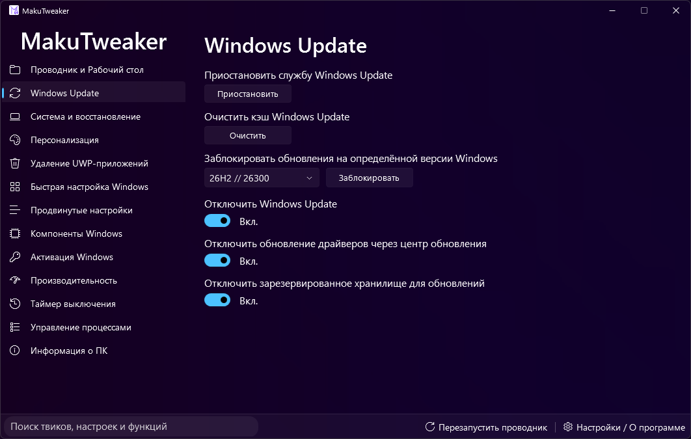
  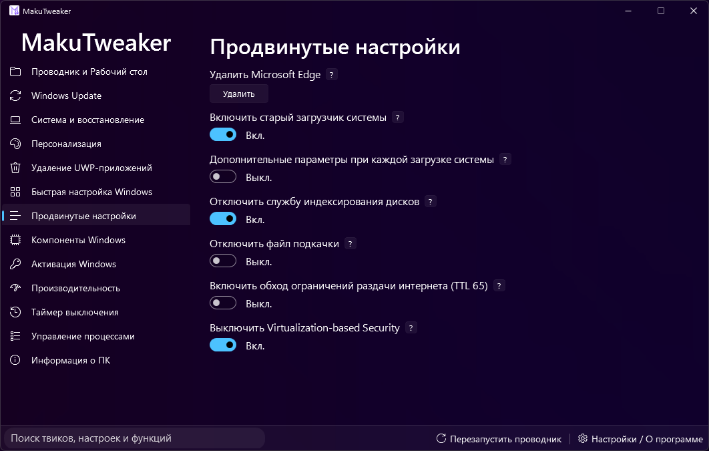
  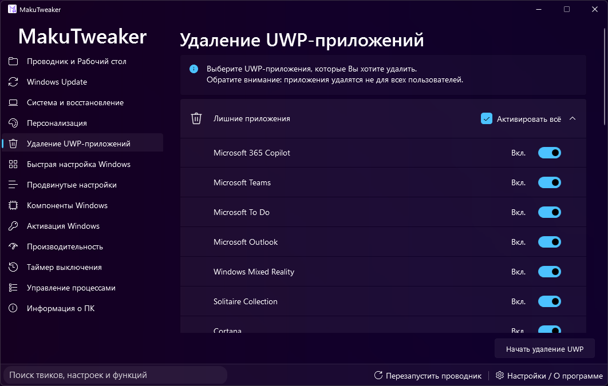
  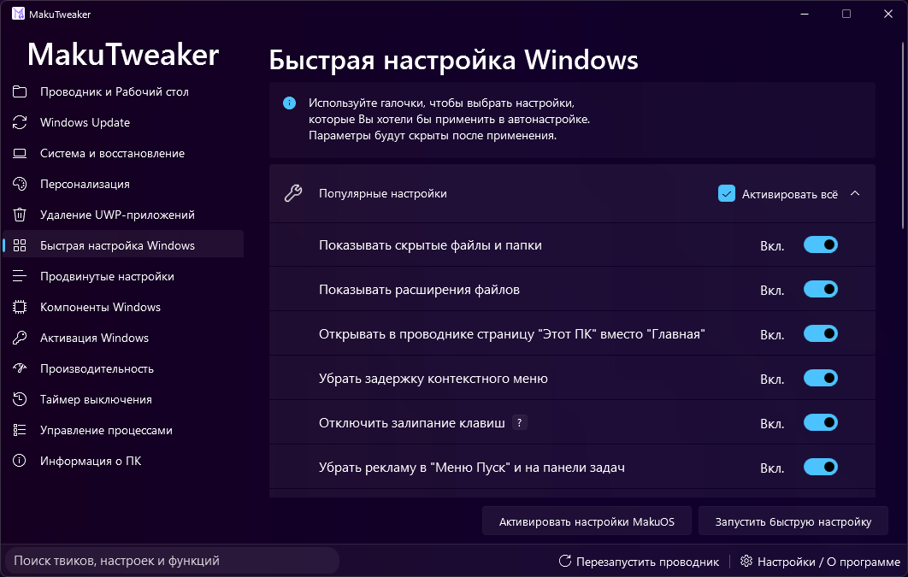
  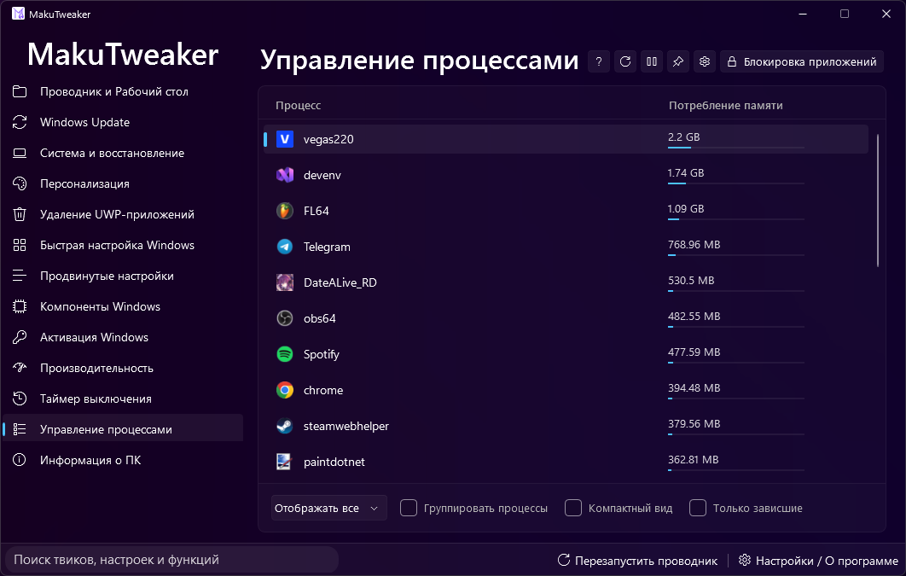
  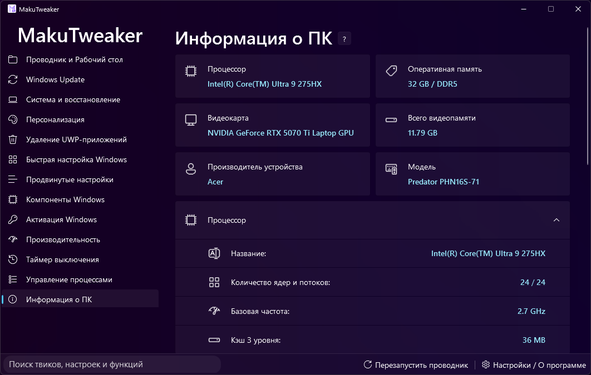

## Особенности

- Основан на проекте **MakuTweaker**
- Полностью адаптирован для Linux
- Открытый исходный код
- Современный интерфейс
- Регулярные обновления
- Поддержка популярных дистрибутивов Linux

## Автор

Fork & Linux Port:
**Steelium**

Original Project:
**MakuTweaker**

---

<b>🇺🇸 English</b>

# MakuTweaker 4 Linux

**MakuTweaker 4 Linux** is a Linux port and community fork of the original MakuTweaker.

Created by **Steelium**, this project aims to bring an easy-to-use tweaking and optimization utility to Linux users.

## Features

- Linux system tweaking
- Performance optimization
- Desktop customization
- System information viewer
- Process and service management
- Temporary file cleaner
- Package management tools
- Modern UI with multiple themes

  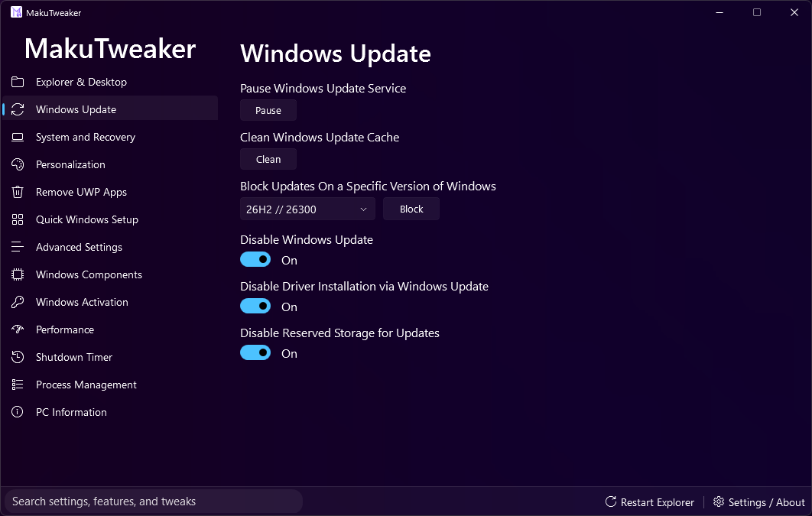
  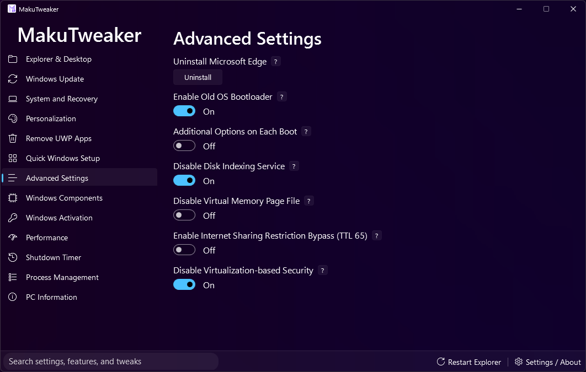
  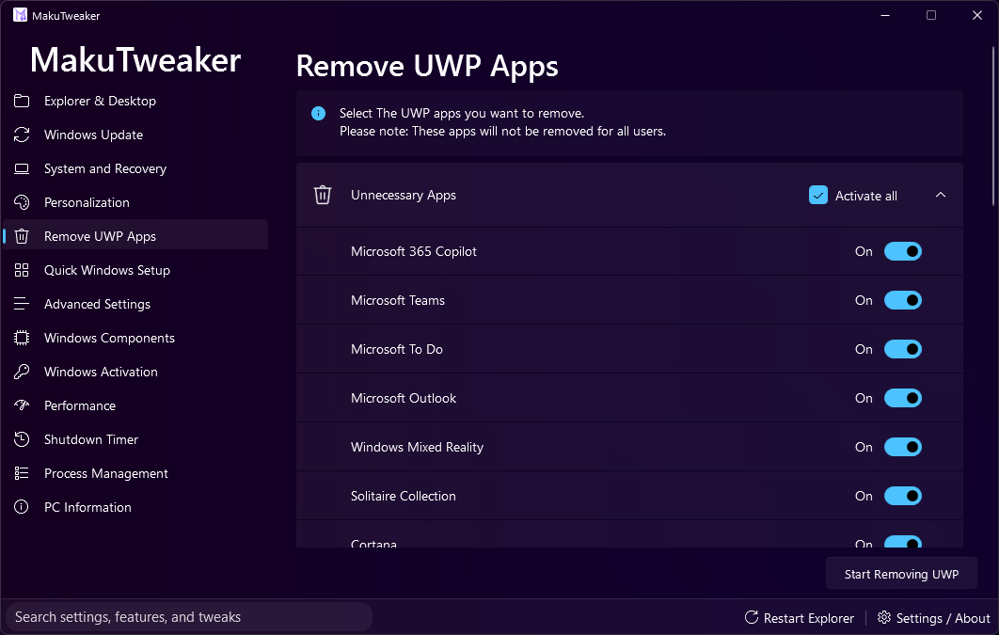
  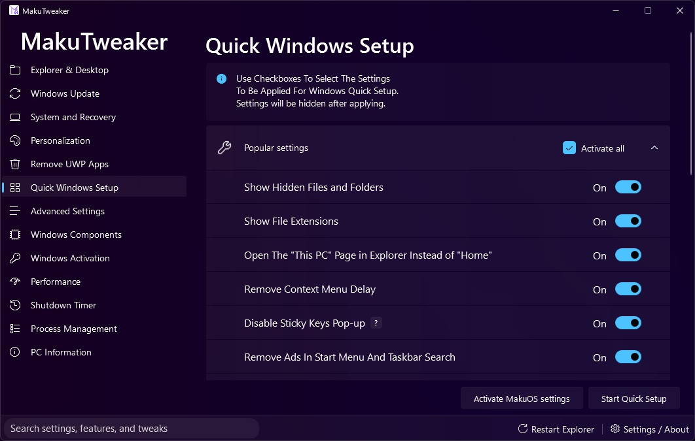
  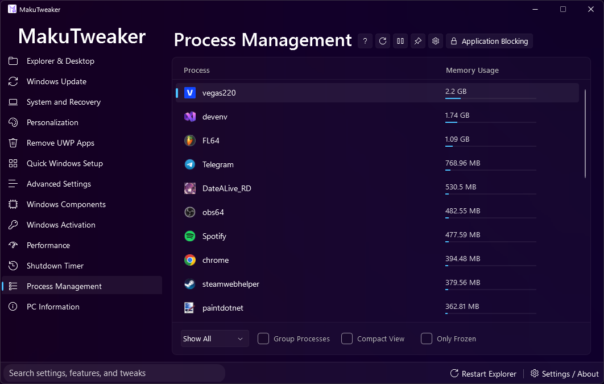
  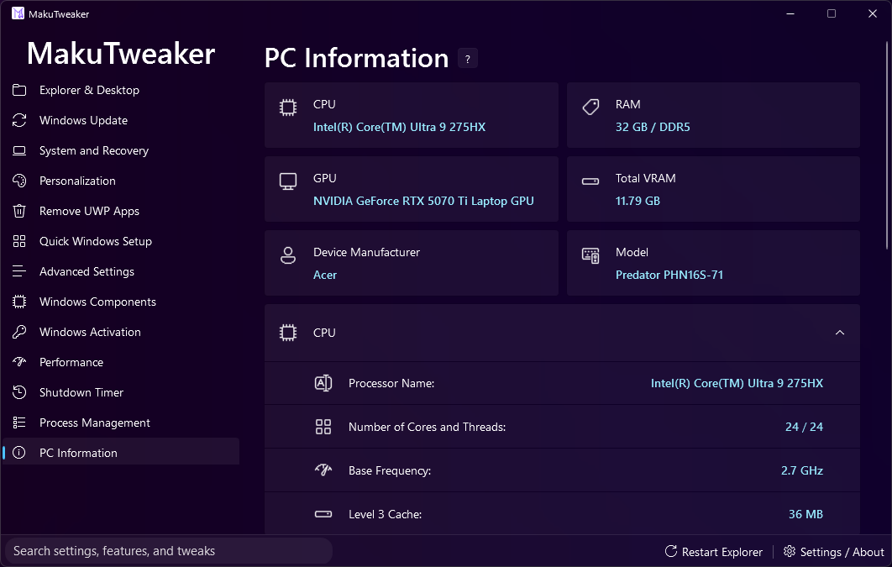

## Highlights

- Based on the original **MakuTweaker**
- Fully adapted for Linux
- Open-source
- Modern interface
- Regular updates
- Supports popular Linux distributions

## Credits

Linux Port & Fork:
**Steelium**

Original Application:
**MakuTweaker**

---

## Supported Linux Distributions

- Ubuntu
- Debian
- Linux Mint
- Fedora
- Arch Linux
- EndeavourOS
- Manjaro
- openSUSE
- Pop!_OS
- Kali Linux
- Zorin OS
- Elementary OS

---

## License

This project is a community fork of **MakuTweaker**.

Please respect the license of the original project.

Linux modifications and additional functionality © **Steelium**.
